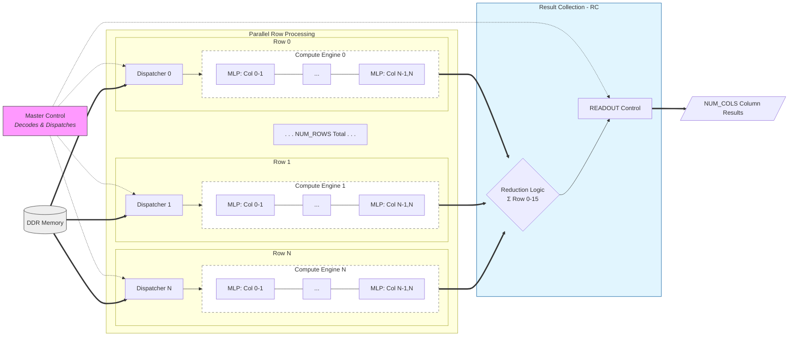
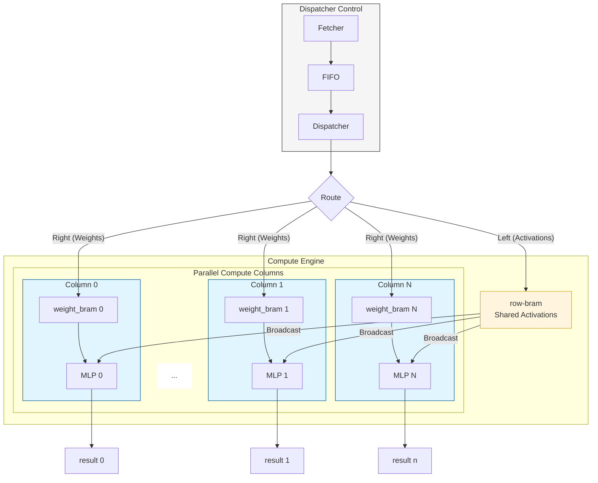

# MULTI-ROW GEMM REFERENCE MANUAL
## Table of Contents

1. [Numbering Format and Configurations](#numbering-format-and-configurations)
   - [Signal Naming Convention](#signal-naming-convention)
   - [GFP8 Number Format](#gfp8-number-format)
   - [Terminology and Default Configurations](#terminology-and-default-configurations)
2. [General Interpretation of Compute Pattern](#general-interpretation-of-compute-pattern)
   - [Partition Functions](#partition-functions)
   - [Normal GEMM Compute Pattern](#normal-gemm-compute-pattern)
   - [1-D GEMM (One-Row) Compute Pattern](#1-d-gemm-one-row-compute-pattern)
   - [2-D GEMM (Multi-Row) Compute Pattern](#2-d-gemm-multi-row-compute-pattern)
   - [Hardware Implementation: Per-Row Memory Model](#hardware-implementation-per-row-memory-model)
   - [Compute Pattern Summary](#compute-pattern-summary)
3. [Architecture Overview](#architecture-overview)
   - [Master Control (MC)](#master-control-mc)
   - [Dispatcher Control (DC)](#dispatcher-control-dc)
   - [Compute Engine (CE)](#compute-engine-ce)
   - [Result Collection (RC)](#result-collection-rc)
   - [Overall Architecture Summary](#overall-architecture-summary)
4. [Core Architecture](#core-architecture)
   - [Command Submission Flow (DMA-Based)](#command-submission-flow-dma-based)
   - [dma_cmd_in_bram](#dma_cmd_in_bram)
   - [cmd_bram_fifo_bridge](#cmd_bram_fifo_bridge)
   - [cmd_fifo](#cmd_fifo)
   - [master_control_2d](#master_control_2d)
   - [Dispatcher Control](#dispatcher-control)
   - [Fetcher](#fetcher)
   - [Dispatcher](#dispatcher)
   - [Compute Engine (MLP-Based)](#compute-engine-mlp-based)
   - [comp_MLPStack](#comp_mlpstack)
   - [Dispatcher Control and Compute Engine Overview](#dispatcher-control-and-compute-engine-overview)
5. [Microcode Command Reference](#microcode-command-reference)
   - [Command Organization](#command-organization)
   - [Command Summary Table](#command-summary-table)
   - [Command 0xF0: FETCH_MEMORY_BLOCK](#command-0xf0-fetch_memory_block)
   - [Command 0xF1: VECTOR_DISPATCH](#command-0xf1-vector_dispatch)
   - [Command 0xF2: MATMUL (TILE)](#command-0xf2-matmul-tile)
   - [Command 0xF3: WAIT_DISPATCH](#command-0xf3-wait_dispatch)
   - [Command 0xF4: WAIT_MATMUL](#command-0xf4-wait_matmul)
   - [Command 0xF5: VECTOR_READOUT](#command-0xf5-vector_readout)
   - [Important Notes](#important-notes)
6. [Ready-Valid Protocol and FIFO Patterns](#ready-valid-protocol-and-fifo-patterns)
   - [Universal Handshake Protocol](#universal-handshake-protocol)
   - [FIFO Types and Usage](#fifo-types-and-usage)
   - [FIFO Placement in Data Path](#fifo-placement-in-data-path)
   - [Key Synchronization Patterns](#key-synchronization-patterns)
   - [Synchronization Points](#synchronization-points)
   - [Design Rules](#design-rules)
7. [Comparison with AMD GEMM Reference Design](#comparison-with-amd-gemm-reference-design)
   - [Array Configuration](#array-configuration)
   - [Memory Block Format](#memory-block-format)
   - [Data Routing Architecture](#data-routing-architecture)
   - [Compute Engine Structure](#compute-engine-structure)
   - [Result Collection](#result-collection)
   - [V and C Distribution Algorithm](#v-and-c-distribution-algorithm)
   - [Command Set](#command-set)
   - [Synchronization Model](#synchronization-model)
   - [What ACX Adopts from AMD](#what-acx-adopts-from-amd)
   - [What ACX Keeps Different](#what-acx-keeps-different)

## Numbering Format and Configurations

### Signal Naming Convention
The signals on the interfaces should generally follow this naming convention:
`[i/o]_[fetch/disp/comp or other components]_[field_2]_[field_3]_...[field_n]`. Essentially, the first field should suggest if it is an input or output signal. If it is internal, then, the first two fields should be `[src]_[dest]_...` to show where the signal comes from and goes to. If it is minor miscellaneous signals, it doesn't have to follow the naming convention strictly.

### GFP8 Number Format
[GFP Explanation](../emulator/GFP_EXPLANATION.md)

### Terminology and Default Configurations

- GFP8: 
  - Group Floating-Point
  - 8-bit mantissa, 5-bit exponent
- GFP4: 
  - Group Floating-Point
  - 4-bit mantissa, 5-bit exponent
- Group Size:
  - The size of GFP group that shares one exponent
  - Default: 32
- Native Vector (NV):
  - A vector of GFP numbers
  - May contain multiple groups
  - Hardware considerations
- Native Vector Size:
  - The number of GFP numbers in a Native Vector
  - Default: 128
  - 4 groups of GFP numbers, 4 bytes of exponent, 128 bytes of mantissa
- AXI Bus Width:
  - The bitwidth of the on-chip AXI Bus
  - Default: 256-bit
- Memory Block:
  - A block of memory to be Fetched at once from DDR6 to on-chip BRAM
  - Default: 128 Native Vectors
  - Since the transaction on AXI is limited to 256-bit wide, we save them in 256-bit wide BRAMs. One memory block is therefore 528 memory lines in BRAM: 16 lines of exponents and 512 lines of mantissas, in that order (first 16 lines are exponents; the rest are mantissas.) One NV of the default size is 4 exponents (4 bytes) and 4 lines in BRAM (128 bytes).
- Grouped Dimension (GD):
  - The dimension in a matrix along which the GFP numbers are grouped
  - Usually the inner dimension (V) in the context of Matrix-Matrix Multiplication
- UnGrouped Dimension (UGD):
  - The dimension in a matrix that is not grouped. 
  - Usually the outer dimensions (batch B, column C) in the context of Matrix-Matrix Multiplication
- Left UGD length (B/batch/dim_b):
  - The number of UGD vectors to process on left
- Right UGD length (C/column/dim_c):
  - The number of UGD vectors to process on right
- UGD vector length (V/inner dimension/dim_v):
  - The number of Native Vectors per UGD vector
  - Example: if `ugd_len = 8`, then each UGD vector contains 8 NVs (32 lines)
  - Used in column group processing: each column group processes V NVs per column
- Column:
  - MLP columns within the compute engine
  - Configurable via `NUM_COLS` parameter (= `NUM_MLPS * 2`)
- Row:
  - A row of compute engines in 2-D architecture
  - Default: 16 rows, fixed to the number of available DDR6 channels.
---
## General Interpretation of Compute Pattern

This section describes the mathematical computation patterns, progressing from basic GEMM to the parallelized 2-D architecture. The Python model (`gemm/src/py/multi-row_gemm.py`) implements these patterns and serves as the verification reference.

### Partition Functions

Both 1-D and 2-D GEMM use the same distribution algorithm for partitioning work:

```cpp
// Partition function: distributes 'total' items across 'num_partitions' units
// First (total % num_partitions) units get (total / num_partitions + 1) items
// Remaining units get (total / num_partitions) items
void get_partition(int idx, int total, int num_partitions, 
                   int* start, int* count) {
    int base = total / num_partitions;
    int rem = total % num_partitions;
    if (idx < rem) {
        *count = base + 1;
        *start = idx * (base + 1);
    } else {
        *count = base;
        *start = rem * (base + 1) + (idx - rem) * base;
    }
}
```

### Normal GEMM Compute Pattern

```cpp
// GEMM: O = A * W
// Activation A has dimensions B x V (B batches, V inner dimension)
// Weights W has dimensions V x C (V inner dimension, C columns)  
// Output O has dimensions B x C (B batches, C columns)
for (int b = 0; b < B; ++b) {
    for (int c = 0; c < C; ++c) {
        float sum = 0.0;
        for (int v = 0; v < V; ++v) {
            sum += A[b][v] * W[v][c];
        }
        O[b][c] = sum;
    }
}
```

### 1-D GEMM (One-Row) Compute Pattern

Parallelizes across the column dimension using `num_tiles` compute tiles. Each tile handles a subset of output columns computed by `get_partition()`.

```cpp
// PARALLEL across num_tiles (each tile executes independently)
parallel_for (int tile = 0; tile < num_tiles; ++tile) {
    // Determine C range for this tile using partition function
    int c_start, c_count;
    get_partition(tile, C, num_tiles, &c_start, &c_count);
    
    // Sequential computation within tile
    for (int b = 0; b < B; ++b) {
        for (int cc = 0; cc < c_count; ++cc) {
            float sum = 0.0;
            int actual_col = c_start + cc;
            for (int v = 0; v < V; ++v) {
                sum += A[b][v] * W[v][actual_col];
            }
            O[b][actual_col] = sum;
        }
    }
}
```

### 2-D GEMM (Multi-Row) Compute Pattern

Parallelizes across both rows (V dimension) and tiles (C dimension). Each row computes partial sums that must be reduced to produce final results.

```cpp
// Initialize output to zero (required for accumulation)
for (int b = 0; b < B; ++b)
    for (int c = 0; c < C; ++c)
        O[b][c] = 0.0;

// PARALLEL across num_rows (each row executes independently)
parallel_for (int row = 0; row < num_rows; ++row) {
    // Determine V range for this row
    int v_start, v_count;
    get_partition(row, V, num_rows, &v_start, &v_count);
    
    // PARALLEL across num_tiles (each tile executes independently)
    parallel_for (int tile = 0; tile < num_tiles; ++tile) {
        // Determine C range for this tile
        int c_start, c_count;
        get_partition(tile, C, num_tiles, &c_start, &c_count);
        
        // Sequential computation within (row, tile)
        for (int b = 0; b < B; ++b) {
            for (int cc = 0; cc < c_count; ++cc) {
                float partial_sum = 0.0;
                int actual_col = c_start + cc;
                
                for (int vv = 0; vv < v_count; ++vv) {
                    int actual_v = v_start + vv;
                    partial_sum += A[b][actual_v] * W[actual_v][actual_col];
                }
                // ATOMIC: Accumulate partial sum (reduction across rows)
                O[b][actual_col] += partial_sum;
            }
        }
    }
}
```

### Hardware Implementation: Per-Row Memory Model

In hardware, each row has its own GDDR6 channel with **pre-partitioned data**. This eliminates the need to compute `v_start` at runtime:

```cpp
// Hardware model: Each row has its own memblk with pre-partitioned data
// Row r's memblk contains ONLY that row's V slice
// Therefore: v_start = 0, and data is accessed sequentially

parallel_for (int row = 0; row < num_rows; ++row) {
    // V partition for this row (calculated by Master Control)
    int v_count = get_v_count_for_row(row, V, num_rows);
    
    // Row's local data: A_local[B][v_count], W_local[v_count][c_count]
    // Accessed with v_start = 0 (data is pre-partitioned in per-row memblk)
    
    parallel_for (int tile = 0; tile < num_tiles; ++tile) {
        int c_count = get_c_count_for_tile(tile, C, num_tiles);
        
        for (int b = 0; b < B; ++b) {
            for (int cc = 0; cc < c_count; ++cc) {
                float partial_sum = 0.0;
                for (int v = 0; v < v_count; ++v) {  // Local v index, not global
                    partial_sum += A_local[b][v] * W_local[v][cc];
                }
                result_fifo.push(partial_sum);  // Sent to Result Collection
            }
        }
    }
}

// Result Collection: Reduce partial sums from all rows
for (int b = 0; b < B; ++b) {
    for (int c = 0; c < C; ++c) {
        O[b][c] = sum_across_all_rows(b, c);
    }
}
```

This compute pattern is implemented and verified in the Python model at `gemm/src/py/multi-row_gemm.py`.

### Compute Pattern Summary

| Pattern | Parallelism | Reduction Required | Key Characteristic |
|---------|-------------|-------------------|-------------------|
| **Normal GEMM** | None | No | Sequential O = A x W |
| **1-D GEMM** | num_tiles (C dimension) | No | Each tile computes complete dot products |
| **2-D GEMM** | num_rows x num_tiles | Yes (across rows) | Each row computes partial sums |

**Key Points:**
- **Partition Function**: Both V (across rows) and C (across tiles) use the same remainder-distribution algorithm
- **Per-Row Memblk**: Each row has pre-partitioned data, so local V indices start at 0
- **Reduction**: 2-D GEMM requires summing partial results across all rows for each output element
- **B Loop**: The batch dimension (B) is always sequential, not parallelized

--- 

## Architecture Overview

The 2-D Multi-Row GEMM mainly consists of four functional groups: Master Control (MC), Dispatcher Control (DC), Compute Engine (CE), and Result Collection (RC).

### Master Control (MC)
It is the global control unit group. The components in this group decode the commands from the host and dispatch them to each of the execution groups (DC, CE, RC). It sits outside of the execution units, and there is only one MC globally.  

### Dispatcher Control (DC)
It consists of the Fetcher and Dispatcher. It serves the FETCH and DISPATCH commands. Briefly speaking, the Fetcher fetches a memory block from DDR and pushes into a FIFO. The Dispatcher consumes that FIFO and routes to the local buffers in the compute engines. There is one DC per row. 

### Compute Engine (CE)
Each compute engine is a 1-D array of compute tiles, or compute columns, organized into a shared Activation Buffer (`row_bram`) and a compute array (`comp_MLPStack`). The compute engine serves the MATMUL (or TILE) command. The compute unit is called Machine Learning Processor (MLP) in Achronix FPGAs. Each MLP computes two columns. Logically, one MLP represents two compute tiles. Each row in the 2-D GEMM has one compute engine, and each CE computes `NUM_COLS` columns, therefore constituting the 2-D organization. 

### Result Collection (RC)
It sits outside of the rows and collects all the results from each CE columns. It serves the READOUT command. Each compute engine outputs `NUM_COLS` results in parallel, and there are `NUM_ROWS` compute engines. RC reduces all rows on each column, as discussed in the Compute Pattern section. Therefore, RC produces `NUM_COLS` results, one for each column. There is only one RC globally. **IMPORTANT** There are cases where not all rows have meaningful results, in which case these rows needs to be turned off when performing the reduction. We will discuss these cases later.

### Overall Architecture Summary
This is a graph of the 2-D GEMM organization (example with `NUM_ROWS` rows).



## Core Architecture

### Command Submission Flow (DMA-Based)

The command submission system uses DMA transfers for high-throughput command batching. This replaces the legacy CSR-based word-by-word command submission.

#### Architecture Overview

```
Host                    FPGA
-----                   ----
  |                       |
  |-- DMA Write --------->| dma_cmd_in_bram (512 x 256-bit)
  |                       |     |
  |-- CSR: DMA_CMD_CNT -->|     | (internal read port)
  |-- CSR: DMA_CMD_VALID->|     v
  |                       | cmd_bram_fifo_bridge
  |<-- Poll DMA_CMD_VALID-|     |
  |                       |     v
  |                       | cmd_fifo (512 x 128-bit)
  |                       |     |
  |                       |     v
  |                       | master_control_2d
```

#### Host-to-FPGA Communication Protocol

**Registers:**
| Register | Offset | Description |
|----------|--------|-------------|
| DMA_CMD_CNT | 0x3C | Number of commands in BRAM (written by host) |
| DMA_CMD_VALID | 0x40 | Start signal: host writes 1, bridge clears to 0 when done |
| DMA_CMD_RD_ADDR | 0x44 | Debug: current read address (read-only) |

**Batch Submission Sequence:**
1. **Host DMAs N commands** to `dma_cmd_in_bram` (addresses 0 to N-1)
2. **Host writes** `DMA_CMD_CNT = N`
3. **Host writes** `DMA_CMD_VALID = 1` (triggers bridge)
4. **Bridge transfers** commands from BRAM to FIFO
5. **Bridge clears** `DMA_CMD_VALID` when all N commands transferred
6. **Host polls** `DMA_CMD_VALID`, sees 0, can DMA next batch

**Safety Conditions:**
- **Host can DMA new commands**: When `DMA_CMD_VALID == 0` (bridge idle)
- **Bridge can read BRAM**: When `DMA_CMD_VALID == 1` (host finished writing)
- **Bridge stops reading**: When `cmd_fifo` is almost full (backpressure)

#### Command Format in BRAM

Each BRAM line is 256 bits, but only the lower 128 bits are used for the command:
```
BRAM Line [255:0]:
  [255:128] = Unused (upper 128 bits)
  [127:96]  = word0 (header: {reserved[15:0], cmd_id[7:0], cmd_op[7:0]})
  [95:64]   = word1 (payload)
  [63:32]   = word2 (payload)
  [31:0]    = word3 (payload)
```

### dma_cmd_in_bram

#### Functionality
DMA-accessible BRAM for command batch storage. Host writes commands via DMA, `cmd_bram_fifo_bridge` reads them internally.

#### Implementation Details
- Uses `dma_bram_bridge` with NAP at column 3, row 6
- 512 entries x 256 bits (internal BRAM size)
- Internal write port: tied off (host writes via DMA only)
- Internal read port: connected to `cmd_bram_fifo_bridge`

### cmd_bram_fifo_bridge

#### Functionality
Simple 2-state FSM that reads batched commands from `dma_cmd_in_bram` and pushes them to `cmd_fifo`. No data manipulation - pure transfer.

#### Implementation Details

**FSM States:**
- **ST_IDLE**: Waits for rising edge on `DMA_CMD_VALID`. On valid edge with non-zero count, captures `DMA_CMD_CNT` and transitions to `ST_READ_BRAM`.
- **ST_READ_BRAM**: Reads BRAM sequentially, pushes 128-bit commands to FIFO. If FIFO almost full, holds position (backpressure). When count reaches 0, pulses `cmd_valid_clr` and returns to `ST_IDLE`.

**Timing:**
- BRAM read latency: 1 cycle
- FIFO push: when `bram_data_valid && !fifo_afull`
- Transfer rate: 1 command per cycle (when FIFO not backpressured)

**Signals:**
| Signal | Direction | Description |
|--------|-----------|-------------|
| i_cmd_cnt | Input | Number of commands to transfer |
| i_cmd_valid | Input | Start signal (rising edge triggers) |
| o_cmd_valid_clr | Output | Pulse to clear DMA_CMD_VALID when done |
| o_bridge_busy | Output | High when actively transferring |

### cmd_fifo

#### Functionality
FIFO buffer for incoming commands. Decouples DMA batch rate from command consumption rate.

#### Implementation Details
- Wrapper around `flex_fifo`
- Width: 128 bits (one full command per entry)
- Depth: 512 entries
- Read latency: 1 cycle (synchronous BRAM)
- Almost-full threshold: ~461 entries (triggers backpressure)

### master_control_2d

#### Functionality
1. Parses 128-bit command MicroCodes in a single cycle
2. Partitions V dimension across 16 rows
3. Routes commands to Fetcher, Dispatcher, Compute Engine, and Result Collection
4. Orchestrates and synchronizes operations with per-row acknowledgments

#### Implementation Details

The Master Control operates as a simplified FSM that reads 128-bit commands from `cmd_fifo` and decodes them in a single cycle.

**States and Transitions:**

- **ST_IDLE** (0)
  - **Action**: Waits for non-empty command FIFO and no backpressure (result FIFO not full).
  - **Transition**:
    - If FIFO not empty and no backpressure -> `ST_WAIT_DATA` (asserts rd_en)
    - Else -> `ST_IDLE`

- **ST_WAIT_DATA** (1)
  - **Action**: Waits 1 cycle for FIFO read latency. Data will be valid next cycle.
  - **Transition**: Always -> `ST_DECODE`

- **ST_DECODE** (2)
  - **Action**: Extracts all 4 command words from 128-bit `i_cmd_fifo_rdata` in single cycle. Performs V-partitioning and populates per-row payload registers. Routes to appropriate EXEC state based on opcode.
  - **128-bit Layout**: `[127:96]=word0, [95:64]=word1, [63:32]=word2, [31:0]=word3`
  - **Transition** (based on `i_cmd_fifo_rdata[103:96]`):
    - `0xF0` -> `ST_EXEC_FETCH`
    - `0xF1` -> `ST_EXEC_DISP`
    - `0xF2` -> `ST_EXEC_MATMUL`
    - `0xF3` -> `ST_WAIT_DISP`
    - `0xF4` -> `ST_WAIT_MATMUL`
    - `0xF5` -> `ST_EXEC_READOUT`
    - Unknown -> `ST_IDLE`

- **ST_EXEC_FETCH** (3)
  - **Action**: Waits for ALL 16 rows to acknowledge FETCH (`all_dc_ack_fetch`).
  - **Transition**: If all ACKs received -> `ST_IDLE`

- **ST_EXEC_DISP** (4)
  - **Action**: Waits for ALL 16 rows to acknowledge DISPATCH (`all_dc_ack_disp`).
  - **Transition**: If all ACKs received -> `ST_IDLE`

- **ST_EXEC_MATMUL** (5)
  - **Action**: Waits for ALL 16 rows to acknowledge MATMUL (`all_ce_ack_matmul`).
  - **Transition**: If all ACKs received -> `ST_CMD_COMPLETE`

- **ST_WAIT_DISP** (6)
  - **Action**: Barrier for DISPATCH. Waits until all rows have `dc_id >= wait_id`.
  - **Transition**: If all rows complete -> `ST_CMD_COMPLETE`

- **ST_WAIT_MATMUL** (7)
  - **Action**: Barrier for MATMUL. Waits until all rows have `ce_id >= wait_id`.
  - **Transition**: If all rows complete -> `ST_CMD_COMPLETE`

- **ST_EXEC_READOUT** (8)
  - **Action**: Waits for Result Collector acknowledgment (`rc_ack_readout`).
  - **Transition**: If ACK received -> `ST_CMD_COMPLETE`

- **ST_CMD_COMPLETE** (9)
  - **Action**: Clears opcode, ready for next command.
  - **Transition**: Always -> `ST_IDLE`

**Key Improvement over Legacy:**
- Old: 4 cycles to read 4 x 32-bit words (ST_READ_HDR, ST_READ_PAYLOAD1/2/3)
- New: 1 cycle to decode full 128-bit command (ST_DECODE directly uses FIFO data)

### Command-Path and Data-Path

#### Command Path: Host -> Compute Engine

The command path flows from the host through DMA to the compute engines:

```
Host (DMA)
    |
    v
dma_cmd_in_bram (NAP[3][6])
    |  - Host DMAs batch of 128-bit commands to BRAM addresses 0..N-1
    |  - Each BRAM line is 256-bit, lower 128 bits contain the command
    |  - Host writes DMA_CMD_CNT=N and DMA_CMD_VALID=1 to trigger transfer
    v
cmd_bram_fifo_bridge
    |  - Monitors dma_cmd_valid_reg
    |  - FSM: IDLE -> READ_BRAM -> IDLE (2-state)
    |  - Reads 256-bit from BRAM, extracts lower 128-bit command
    |  - Pushes to FIFO; pauses on almost-full backpressure
    |  - Auto-clears DMA_CMD_VALID when all commands transferred
    v
cmd_fifo (inside engine_top_2d)
    |  - Wrapper around flex_fifo (512 deep x 128 wide)
    |  - Buffers commands until consumed by master_control_2d
    v
master_control_2d
    |  - FSM: IDLE -> WAIT_DATA -> DECODE -> ST_EXEC_*
    |  - Reads 128-bit command, extracts opcode and payload
    |  - Dispatches to per-row execution units based on opcode:
    |      OPC_FETCH (0xF0)   -> dispatcher_control_2d[0:15]
    |      OPC_DISPATCH (0xF1)-> dispatcher_control_2d[0:15]
    |      OPC_MATMUL (0xF2)  -> compute_engine_2d[0:15]
    |      OPC_READOUT (0xF5) -> result_collector_2d
    v
Per-Row Execution Units (x16)
```

**Command Format (128-bit):**
```
[127:96] = word0: {16'b0, cmd_id[7:0], cmd_op[7:0]}
[95:64]  = word1: payload (varies by opcode)
[63:32]  = word2: payload (varies by opcode)
[31:0]   = word3: payload (varies by opcode)
```

#### Data Path: GDDR6 -> Results

The data path flows from GDDR6 memory through computation to result output:

```
GDDR6 Memory (8 controllers, 16 channels)
    |
    v
NAP Responders (16x, one per row)
    |  - NAP[r] at column 1 (west, rows 0-7) or 10 (east, rows 8-15)
    |  - AXI4 interface to NoC for memory access
    v
dispatcher_control_2d[r] - Fetcher Stage
    |  - Triggered by OPC_FETCH command
    |  - Issues AXI read bursts to GDDR6 via NAP
    |  - Receives 256-bit data lines from memory
    |  - Unpacks BF16 mantissa (256-bit) and exponent (8-bit)
    |  - Writes to internal FIFO for dispatcher stage
    v
dispatcher_control_2d[r] - Dispatcher Stage
    |  - Triggered by OPC_DISPATCH command (or pipelined after fetch)
    |  - Routes data to compute engine BRAMs:
    |      Left path:  row_bram (activations/inputs)
    |      Right path: weight BRAMs (per MLP column)
    |  - Left path signals: dc_left_man_wr_*, dc_left_exp_wr_*
    |  - Right path signals: dc_right_wr_*, dc_right_man_wr_*, dc_right_exp_wr_*
    v
compute_engine_2d[r]
    |  - Triggered by OPC_MATMUL command
    |  - Contains: row_bram, MLPStack (NUM_MLPS x STACK_DEPTH MLPs), result FIFOs
    |  - Reads activations from row_bram, weights from MLP weight BRAMs
    |  - Performs BF16 dot products via MLP primitives
    |  - Accumulates partial sums across V iterations
    |  - Outputs FP16 results to per-column result FIFOs
    |  - Result interface: o_result_data[NUM_COLS-1:0] (FP16 per column)
    v
result_collector_2d
    |  - Triggered by OPC_READOUT command
    |  - Reads FP16 results from all 16 rows x NUM_COLS compute engines
    |  - Performs row-wise reduction (sum across V partitions)
    |  - Packs 16 FP16 values into 256-bit output lines
    |  - Ready-valid interface to result_to_dma
    v
result_to_dma
    |  - Converts ready-valid to BRAM write interface
    |  - o_bram_wr_en, o_bram_wr_addr (9-bit), o_bram_wr_data (256-bit)
    v
dma_data_out_bram (NAP[3][5])
    |  - Internal write ports receive engine results
    |  - Host DMAs read results via PCIe
    v
Host (DMA Read)
```

**Data Widths Summary:**

| Stage | Signal | Width | Description |
|-------|--------|-------|-------------|
| GDDR6 -> NAP | AXI RDATA | 256-bit | Memory read data |
| Fetcher -> FIFO | Internal | 256-bit + 8-bit | Mantissa + exponent |
| Dispatcher -> CE | Left path | 256-bit + 8-bit | Activations |
| Dispatcher -> CE | Right path | 256-bit + 8-bit | Weights (per-col) |
| CE -> RC | Result FIFO | 16-bit | FP16 per column |
| RC -> DMA | Output | 256-bit | 16 x FP16 packed |
| DMA -> Host | BRAM | 256-bit | Result lines |

### Dispatcher Control (Detailed)
#### Functionality (Revised Architecture)
Acts as the central router for the row's data ingress. It couples the `Fetcher` with the `Dispatcher` logic via a streaming FIFO interface, eliminating the need for intermediate storage for weights.

#### Implementation Details
- **Streaming FIFO**: A FIFO connects the `Fetcher` (Producer) and the `Dispatcher` (Consumer).
- **Fetcher Role**: Pure DMA engine. Reads from GDDR6 and pushes raw data into the FIFO. It is agnostic to the data's destination (Left vs. Right).
- **Dispatcher Role**: Consumes the FIFO and performs routing based on the command type:
  - **Left Data (Activations)**: Routed to `row_bram`.
  - **Right Data (Weights)**: Routed directly to `weight_bram` inside the Compute Columns via round-robin distribution, bypassing `row_bram` entirely.
  - **Right Distribution**: Since intermediate buffering is skipped, the dispatcher logic distributes the weights directly to the local memories (`weight_bram`) of the compute columns.

#### Key Architectural Differences
- **No Intermediate Buffer for Weights**: The concept of an "Intermediate Weight Buffer" in `row_bram` is removed. Weights stream from Memory -> FIFO -> Dispatcher -> `weight_bram`, reducing latency and eliminating double-buffering.
- **Dedicated Activation Buffer**: `row_bram` is dedicated solely to storing activations (Left Matrix) which need to be reused (broadcasted) across many compute tiles during the `MATMUL` operation.

### Fetcher
#### Functionality
Efficiently manages high-bandwidth data transfers from GDDR6 memory to a Streaming FIFO.

#### Implementation Details
- **Burst Management**: Issues up to 32 AXI read bursts back-to-back using a 32-deep FWFT FIFO for Address Read (AR) requests.
- **Data Unpacking**: Separates Exponents and Mantissas from the memory block.
- **Destination**: Writes to the Streaming FIFO interface instead of addressing `row_bram` directly.

### Dispatcher
#### Functionality
Consumes the Fetch FIFO and manages the writing of **Activation** data to the `row_bram` and **Weight** data directly into the distributed `weight_bram`.

#### Implementation Details
- **2-Stage Stream**: For both left (Activation) and right (Weight) data, the Dispatcher always processes data in units of one memory block (528 256-bit lines). "2-Stage" refers to:
  - **Stage-1 (Exponents)**: Reading and buffering the first 16 lines (exponents) to a local exponent BRAM (512 exponents).
  - **Stage-2 (Mantissas)**: Reading the remaining 512 lines (mantissas). For each line, the Dispatcher attaches the corresponding exponent buffered in Stage-1 and forwards the packet to the correct destination: `row_bram` for Left/Activation, or `weight_bram` for Right/Weight.
- **Distribution Logic**:
  - **Right Data**: Uses `col_start` to Round-Robin distribute the stream to specific columns' `weight_bram`. **Always Distributes** (no broadcast mode).
  - **Left Data**: Writes are redirected to the `row_bram` write ports.

### Compute Engine (MLP-Based)
#### Functionality
The top-level execution unit for a row. It is organized into two primary components:
1. **row_bram**: A shared Activation Buffer for storing the "Left" matrix data.
2. **comp_MLPStack**: The compute array consisting of multiple compute columns and their local weight buffers (`weight_bram`).

#### Inputs and Control
The Compute Engine receives two distinct types of inputs:
- **Control Path**: Decoded arguments and parameters from the `MATMUL` (or `TILE`) command, provided by Master Control.
- **Data Path**: Two **identical** data paths from Dispatcher Control. One path fills the `row_bram` with activations, and the other fills the distributed `weight_bram` with weights.

#### Implementation Details
- **Memory Primitives**: Both `row_bram` and `weight_bram` are essentially based on `ACX_BRAM72K` memory primitives.
- **Direct Write**: The write operation to both `row_bram` and `weight_bram` is driven directly by Dispatcher Control line-by-line during `DISPATCH` phases.
- **Activation Buffer (`row_bram`)**:
  - Serves **only** as the Activation Buffer for Left matrix data reused across columns.
  - Implemented using inferred memory logic, which is suitable for the shared activation access pattern.
- **Command Handling**:
  - `FETCH` (Left): Fills `row_bram` via the Dispatcher.
  - `FETCH` (Right) + `DISPATCH`: Operates as a streaming pipeline. The Dispatcher streams data from the Fetch FIFO directly into the `comp_MLPStack` (local buffer).
  - `MATMUL`: Triggers computation using Activations from `row_bram` and Weights already resident in `weight_bram`.

### comp_MLPStack
#### Functionality
The core computational kernel comprising `NUM_COLS` Compute Columns (derived from `NUM_MLPS` MLPs, each handling two banks/columns). It handles the storage of weights in local buffer (`weight_bram`) and executes the Dot Product computation.

#### Implementation Details
- **4-Stack Architecture**: Each column contains 4 parallel "stacks". This increases throughput 4x compared to a single-stack design.
  - **Loading**: Accepts 4 chunks of data (128 elements total) in parallel during DISPATCH, completing an NV in 4 cycles.
  - **Computing**: Streams 4 partial dot products in parallel during MATMUL.
- **Result Production and the Adder Tree**:
  - Each column produces exactly **one final result** for the entire dot product calculation (summing across all $V$ elements).
  - The **Integer-Domain Adder Tree** (Pipeline) sits at the end of the stacks. It reduces the 4 partial products (one from each stack) into a single high-precision intermediate value for the column.
- **Two-Stage Accumulation**:
  - **Stage 1 (Internal)**: Accumulation over the inner dimension ($V$) happens inside the MLP primitives using the `accumulate` signal.
  - **Stage 2 (Parallel)**: Summation across the 4 parallel stacks happens in the external adder pipeline.
- **Rounding and Output**:
  - The pipeline performs a single rounding operation at the very end (FP24 -> Int -> Sum -> FP16) to minimize precision loss.
  - Results are output as **FP16** values.
- **MLP and weight_bram Relation**: 
  - Each `MLP` is tightly coupled with its own `weight_bram` (local buffer). 
  - The `weight_bram` provides the "Right" matrix data (weights) directly to the MLP multipliers via dedicated internal buses.
  - In a 2-bank configuration, one `weight_bram` word (144 bits) serves two logical columns (72 bits each), enabling one MLP to process two columns simultaneously.

> **IMPORTANT**: The files `comp_MLP.sv`, `comp_MLPRow.sv`, `weight_bram.sv`, and `comp_mlp_dot16_bfp8.sv` are verified low-level primitives and **SHOULD NEVER BE MODIFIED**. Any architectural changes should be implemented at the `comp_MLPStack.sv` level or above.


### Dispatcher Control and Compute Engine Overview


## Microcode Command Reference

This section documents all commands supported by the multi-row MS2.0 architecture, aligned with the driver implementation (`vp815_gemm_device.hpp`) and hardware specification.

### Command Organization

**Fixed 4-Word Format**: All commands use a consistent 4-word (128-bit) structure for uniform FIFO processing:
- **Word 0**: Command Header (32 bits)
  - Bits [31:16]: Total length in bytes (usually 16)
  - Bits [15:8]: Command ID (for tracking and synchronization)
  - Bits [7:0]: Opcode
- **Words 1-3**: Command Payload (96 bits total, unused words = 0x00000000)

### Command Summary Table

| Opcode | Name | Number of Arguments | Purpose |
|--------|------|---------------------|---------|
| 0xF0 | fetch_memory_block | 3 | Transfer memory block from GDDR6 to Dispatcher_bram |
| 0xF1 | vector_dispatch | 8 | Copy data from Dispatcher_bram to tile_brams |
| 0xF2 | matmul | 9 | Execute parallel matrix multiplication across enabled tiles |
| 0xF3 | wait_dispatch | 1 | Synchronization barrier - wait for DISPATCH command to complete |
| 0xF4 | wait_matmul | 1 | Synchronization barrier - wait for MATMUL command to complete |
| 0xF5 | vector_readout | 2 | Read result vectors from result_brams to host |

---

### Command 0xF0: FETCH_MEMORY_BLOCK

**Purpose**: Fetch a memory block (528 lines) from GDDR6 external memory. Each row will receive the same number of memory blocks, but different ugd_len is possible (see below for details). The memory lines will be pushed into a FIFO, and the Dispatcher will consume that FIFO. 

#### Hardware Packing (4-Word Format)

```cpp
cmd[0] = {16'd16, cmd_id[7:0], OPC_FETCH}
cmd[1] = {start_addr[31:0]}
cmd[2] = {ugd_len[15:0], len[15:0]}
cmd[3] = {31'b0, fetch_right}
```

#### Field Details

- **Start Address**: 
  - **Definition**: The starting byte address in GDDR6 memory.
  - **Hardware Format**: The host provides a byte address, which hardware converts to 32-byte line units (`addr / 32`) in Word 1.
  - **Scope**: Offset relative to the GDDR6 page base.
  - **2-D Multi-Row Implementation**: This address is treated as a channel-local offset.
    - The Master Control broadcasts this common offset to all rows. 
    - Each row's implementation (Dispatcher) implicitly targets its corresponding DDR channel (e.g., Row 0 -> Channel 0). No explicit channel selection bits are needed in the address field itself.
- **UGD Length**: The total size of the Inner Dimension (V) in terms of Native Vectors. i.e. The number of Native Vectors per UGD. 
  - **Purpose**: Defines the total computational depth along the reduction axis.
  - **Row Distribution Logic**: The Master Control uses this value to calculate and assign the specific workload for each row (`v_count`), ensuring the total `V` is covered even if it doesn't divide evenly by `num_rows`. The Fetcher will get the **ACTUAL** UGD Length it needs to fetch from GDDR6 calculated by the Master Control.
    - `Base_Count = UGD_Length / num_rows`
    - `Remainder = UGD_Length % num_rows`
    - **Allocation**: The first `Remainder` rows are assigned `Base_Count + 1` NVs. The remaining rows are assigned `Base_Count` NVs.
    - **Example**: If `V = 24` and `num_rows = 16`:
      - `Base = 1`, `Rem = 8`.
      - Rows 0 through 7 process 2 NVs each.
      - Rows 8 through 15 process 1 NV each.
- **Length**: Number of lines to fetch
  - Default: 528 (full block: 16 exponents + 512 mantissas)
- **Fetch Right**: Target buffer selection
  - 0: Fetch to left buffers
  - 1: Fetch to right buffers

---

### Command 0xF1: VECTOR_DISPATCH

**Purpose**: Consumes the FIFO produced by the Fetcher and routes data to the Compute Engine. Based on the target (Left vs. Right), it handles data storage differently:
- **Left Data (Activations)**: Written to `row_bram`, which serves as a shared buffer accessible by all compute tiles (Broadcast).
- **Right Data (Weights)**: Distributed round-robin directly to the compute buffers (`weight_bram`) within the compute tiles (Distribute).

#### Hardware Packing (4-Word Format)

```cpp
cmd[0] = {16'd16, cmd_id[7:0], OPC_DISPATCH}
cmd[1] = {nv_cnt[15:0], ugd_len[15:0]}
cmd[2] = {16'b0, tile_addr[15:0]}
cmd[3] = {16'b0, col_start[7:0], 5'b0, disp_right, broadcast, man_4b}
```

#### Field Details

- **NV Count**: Number of Native Vectors to dispatch total (Hardware processes `cnt * 4` lines). It defaults to 128, which is a whole memory block. 
- **UGD Length**: Number of Native Vectors per UGD vector. It is the same as the UGD Length in the FETCH command.
- **Tile Address**: The starting address of the destination buffer.
  - For Left Data (Activations): Linear address in `row_bram`.
  - For Right Data (Weights): Linear address in `weight_bram`.
- **Column Start (col_start)**: The starting column index for round-robin distribution. 
  - Used for **Right Data** (Weights) to determine which tile receives the first chunk.
  - Ignored for **Left Data** (Activations) as they are written to the shared `row_bram`.
- **Flags**:
  - `disp_right`: 1=Dispatch to Right (Weights), 0=Dispatch to Left (Activations).
  - `broadcast`: 1=Broadcast to Shared Buffer (Left), 0=Distribute Round-Robin (Right). Typically `broadcast = ~disp_right`.
  - `man_4b`: 1=4-bit mantissa mode, 0=8-bit

---

### Command 0xF2: MATMUL (TILE)

**Purpose**: Execute parallel matrix multiplication across enabled compute tiles.

#### Hardware Packing (4-Word Format)

```cpp
cmd[0] = {16'd16, cmd_id[7:0], OPC_MATMUL}
cmd[1] = {left_addr[15:0], right_addr[15:0]}
cmd[2] = {left_len[15:0], right_len[15:0]}
cmd[3] = {ugd_len[15:0], 13'b0, left_4b, right_4b, main_loop_left}
```

#### Field Details

- **Left/Right Address**: Starting line address in the respective buffers (0-511).
  - **Left**: Address in `row_bram` (Activations).
  - **Right**: Address in `weight_bram` (Weights).
- **Left Length**: Number of UGD vectors on left (Batch dimension)
- **Right Length**: Number of UGD vectors on right (Column dimension)
- **UGD Length**: Number of Native Vectors per UGD vector (Inner dimension)
- **Flags**:
  - `left_4b`/`right_4b`: 1=4-bit mantissa, 0=8-bit
  - `main_loop_left`: 1=Loop over left matrix first, 0=Loop over right

---

### Command 0xF3: WAIT_DISPATCH

**Purpose**: Synchronization barrier - blocks execution until specified DISPATCH command completes.

#### Hardware Packing (4-Word Format)

```cpp
cmd[0] = {16'd16, cmd_id[7:0], OPC_WAIT_DISPATCH}
cmd[1] = {24'd0, wait_id[7:0]}
cmd[2] = 0
cmd[3] = 0
```

- **wait_id**: The ID of the DISPATCH command to wait for. The Master Control releases the barrier when the last completed DISPATCH `cmd_id >= wait_id`. 

---

### Command 0xF4: WAIT_MATMUL

**Purpose**: Synchronization barrier - blocks execution until specified MATMUL command completes.

#### Hardware Packing (4-Word Format)

```cpp
cmd[0] = {16'd16, cmd_id[7:0], OPC_WAIT_MATMUL}
cmd[1] = {24'd0, wait_id[7:0]}
cmd[2] = 0
cmd[3] = 0
```

- **wait_id**: The ID of the MATMUL command to wait for. The Master Control releases the barrier when the last completed MATMUL `cmd_id >= wait_id`. 

---

### Command 0xF5: VECTOR_READOUT

**Purpose**: Read result vectors from Compute Engine output FIFOs to outgoing BRAMs, prepared for Host DMA read. It also includes the all-reduce on columns for all rows.

#### Hardware Packing (4-Word Format)

```cpp
cmd[0] = {16'd16, cmd_id[7:0], OPC_READOUT}
cmd[1] = {left_len[15:0], right_len[15:0]}
cmd[2] = {16'b0, ugd_len[15:0]}
cmd[3] = 0
```

#### Field Details
- **Left Length**: Number of UGD vectors on left (Batch dimension)
- **Right Length**: Number of UGD vectors on right (Column dimension)
- **UGD Length**: Number of Native Vectors per UGD vector (Inner dimension)

### Important Notes
**FETCH** and **DISPATCH** always come together. **MATMUL/TILE** and **READOUT** always come together. These four commands do not block/barrier the execution flow. The synchronization is enforced by the two **WAIT** commands. The purpose for the synchronization or barrier is for memory coherence. For example, **WAIT_TILE** is to ensure that the current in-use local buffers in the Compute Engine is not overwritten by the next **DISPATCH**. Similarly, **WAIT_DISPATCH** is to ensure that the next **MATMUL** do not read from the data that is currently being written. 

**UGD Length** and **Right Length** are the **Total** number of NVs and UGD vectors that is processed by the whole GEMM. Master Control decodes the commands and will pass the appropriate numbers to the execution units in each row. **UGD Length**, **Right Length**, and **Left Length** should be consistent in one **FETCH-DISPATCH** pair and **MATMUL-READOUT** pair.

---

## Ready-Valid Protocol and FIFO Patterns

This section defines the handshake protocol and FIFO patterns for decoupling and synchronizing data flow between modules.

### Universal Handshake Protocol

All module interfaces use a consistent ready/valid handshake:

```
Producer Side:              Consumer Side:
  o_ready  <── i_ready        o_ready  ──> i_ready
  i_valid  ──> o_valid        i_valid  <── o_valid
  i_data   ──> o_data         i_data   <── o_data
```

**Data Transfer Rule:**
```systemverilog
wire transfer = i_valid & o_ready;  // Data moves when BOTH asserted
```

**Critical Properties:**
- Producer asserts `valid` when data is available
- Consumer asserts `ready` when it can accept data
- Data transfers on the cycle when BOTH are high
- Producer must hold `valid` and `data` stable until transfer occurs
- Consumer must not depend on data until transfer occurs

### FIFO Types and Usage

#### 1. One-Entry FIFO (Bypass Register)
```systemverilog
module one_fifo #(parameter WIDTH) (
    input  logic clk_i, reset_i,
    output logic o_ready,
    input  logic i_valid,
    input  logic [WIDTH-1:0] i_data,
    input  logic i_ready,
    output logic o_valid,
    output logic [WIDTH-1:0] o_data
);
    // Key property: ready_o = ~valid_r | ready_i
    // Accepts new data even while outputting (zero bubble)
```

**Use Cases:**
- Pipeline registers with back-pressure support
- Minimal latency path where buffering not needed
- Breaking combinational paths

#### 2. Two-Entry FIFO (Decoupling Buffer)
```systemverilog
module two_fifo #(parameter WIDTH) (
    input  logic clk_i, reset_i,
    output logic o_ready,
    input  logic i_valid,
    input  logic [WIDTH-1:0] i_data,
    input  logic i_ready,
    output logic o_valid,
    output logic [WIDTH-1:0] o_data
);
    // Key property: Decouples producer/consumer timing
    // Can accept while full if consumer reads same cycle
```

**Use Cases:**
- Module boundary decoupling
- Command FIFOs between control stages
- Absorbing timing variations between stages

#### 3. Deep FIFO (Rate Matching Buffer)
```systemverilog
module flex_fifo #(parameter WIDTH, DEPTH) (
    input  logic clk_i, reset_n_i,
    input  logic [WIDTH-1:0] i_data,
    input  logic i_wr_en,
    output logic o_full, o_afull,
    output logic [WIDTH-1:0] o_data,
    input  logic i_rd_en,
    output logic o_empty
);
    // Key property: Deep buffering for rate mismatch
    // Almost-full threshold for flow control
```

**Use Cases:**
- Streaming FIFO between Fetcher and Dispatcher
- Result collection buffering
- Absorbing burst traffic

### FIFO Placement in Data Path

```
┌─────────────────────────────────────────────────────────────────────────────┐
│                              Data Flow with FIFOs                           │
└─────────────────────────────────────────────────────────────────────────────┘

Host DMA ──> [dma_cmd_in_bram] ──> [cmd_bram_fifo_bridge] ──> [cmd_fifo] ──> Master Control
                                                                               │
                                                  (Direct command broadcast to all rows)
                                                                               │
┌──────────────────────────────────────────────────────────────────────────────┼────────────┐
│ Per-Row Data Path                                                            │            │
│                                                                              ▼            │
│   GDDR6 ──> Fetcher ──> [streaming_fifo] ──> Dispatcher   <── DC/CE Commands             │
│                                                  │                                        │
│                            ┌─────────────────────┴─────────────────────┐                 │
│                            ▼                                           ▼                 │
│                       row_bram                                    weight_bram            │
│                      (Activations)                               (Weights)               │
│                            │                                           │                 │
│                            └─────────────┬─────────────────────────────┘                 │
│                                          ▼                                               │
│                                    MLP Compute                                           │
│                                          │                                               │
│                                   [result_fifo]                                          │
│                                          │                                               │
└──────────────────────────────────────────┼───────────────────────────────────────────────┘
                                           ▼
                              Result Collection (RC)
                                           │
                                    [output_fifo]
                                           │
                                           ▼
                                    Host DMA Read
```

### Key Synchronization Patterns

#### Pattern 1: Command FIFO with FSM Consumer

```systemverilog
// FSM consumes commands from FIFO
logic cmd_valid, cmd_ready;
cmd_s cmd_data;

// FIFO output
assign cmd_valid = ~cmd_fifo_empty;
assign cmd_fifo_rd_en = cmd_ready;

always_comb begin
    cmd_ready = 1'b0;  // Default: not consuming
    state_n = state_r;

    case (state_r)
        ST_IDLE: begin
            if (cmd_valid) begin
                state_n = ST_EXECUTE;
                // Latch command parameters here
            end
        end
        ST_EXECUTE: begin
            // Processing...
            if (done) begin
                cmd_ready = 1'b1;  // Consume command
                state_n = ST_IDLE;
            end
        end
    endcase
end
```

#### Pattern 2: Streaming Producer-Consumer

```systemverilog
// Fetcher (Producer) pushes to FIFO
assign fifo_wr_en = fetcher_data_valid & ~fifo_full;
assign fifo_wr_data = fetcher_data;
assign fetcher_stall = fifo_full;  // Back-pressure to memory

// Dispatcher (Consumer) pulls from FIFO
assign fifo_rd_en = dispatcher_ready & ~fifo_empty;
assign dispatcher_data = fifo_rd_data;
assign dispatcher_valid = ~fifo_empty;
```

#### Pattern 3: Multi-Source Synchronization (Result Collection)

```systemverilog
// Wait for ALL active rows before outputting
// row_valid[r] = 1 if row r has valid data
// row_active[r] = 1 if row r participates in this computation

wire all_ready = &(row_valid | ~row_active);  // Valid OR not-active

// Only consume from active rows when all ready
for (int r = 0; r < NUM_ROWS; r++) begin
    assign row_ready[r] = row_active[r] ? (all_ready & output_ready) : 1'b0;
end

assign output_valid = all_ready;
```

#### Pattern 4: Round-Robin Distribution with Back-Pressure

```systemverilog
// Dispatcher distributes to columns round-robin
logic [$clog2(NUM_COLS)-1:0] col_ptr_r;
logic [NUM_COLS-1:0] col_ready;

// Current target column
wire target_ready = col_ready[col_ptr_r];

// Transfer happens when source valid AND target ready
wire transfer = fifo_valid & target_ready;

// Advance pointer on transfer
always_ff @(posedge clk) begin
    if (reset) begin
        col_ptr_r <= '0;
    end else if (transfer) begin
        col_ptr_r <= (col_ptr_r == NUM_COLS-1) ? '0 : col_ptr_r + 1;
    end
end

// Route data to correct column
for (genvar c = 0; c < NUM_COLS; c++) begin
    assign col_valid[c] = fifo_valid & (col_ptr_r == c);
    assign col_data[c] = fifo_data;
end

// Back-pressure to FIFO
assign fifo_ready = target_ready;
```

### Synchronization Points

| Interface | FIFO Type | Purpose |
|-----------|-----------|---------|
| Host → Master Control | Deep (512 entries) | Buffer command bursts |
| Master Control → Dispatcher | Two-entry | Decouple control timing |
| Fetcher → Dispatcher | Deep (configurable) | Rate match DDR to compute |
| Dispatcher → row_bram | None (direct write) | Activations written directly |
| Dispatcher → weight_bram | None (direct write) | Weights streamed directly |
| MLP → Result FIFO | Deep (per column) | Buffer compute results |
| Result Collection → Host | Deep | Buffer for DMA read |

### Design Rules

1. **Always use FIFOs at clock domain boundaries** (if any exist)
2. **Use two_fifo for module decoupling** - prevents timing coupling between stages
3. **Use deep FIFOs for rate mismatches** - DDR burst vs steady compute rate
4. **Never combine valid with external conditions** - valid means data IS ready
5. **Ready can depend on downstream** - back-pressure propagates upstream
6. **Hold valid/data stable** until transfer (valid & ready) occurs

---

## Comparison with AMD GEMM Reference Design

This section documents key architectural differences between the ACX multi-row GEMM and the AMD reference implementation (see [AMD_GEMM_REFERENCE.md](AMD_GEMM_REFERENCE.md) for full details).

### Array Configuration

| Aspect | AMD GEMM | ACX GEMM |
|--------|----------|----------|
| Rows | 16 | 16 |
| Columns | 13 | 16 |
| Memory Interface | HBM (4 AXI per row) | GDDR6 (1 NAP per row) |
| BRAM Primitive | RAMB18E2/RAMB36E2 | ACX_BRAM72K |
| Compute Primitive | Custom `gfp_dotp` | ACX_MLP72 (native BFP8) |

### Memory Block Format

Both designs use identical memory block structure:

| Aspect | AMD | ACX |
|--------|-----|-----|
| Block Size | 128 NVs | 128 NVs |
| Exponent Lines | 16 | 16 |
| Mantissa Lines | 512 | 512 |
| Total Lines | 528 | 528 |
| Line Width | 256 bits | 256 bits |
| Processing Order | Exponent first | Exponent first |

### Data Routing Architecture

**AMD Design:**
```
HBM → gemm_dispatch → vbram_nr1w (tile BRAM)
                      ↓
        Mode selects: broadcast (left) vs distribute (right)
        Both left AND right stored in same tile BRAM
```

**ACX Design:**
```
GDDR6 → Fetcher → Streaming FIFO → Dispatcher
                                      ↓
                    ┌─────────────────┴─────────────────┐
                    ▼                                   ▼
              row_bram                             weight_bram
         (Activations ONLY)                    (Weights ONLY)
           [Broadcast]                         [Distribute]
```

**Key Difference:** ACX explicitly separates activation and weight data paths:
- `row_bram`: Dedicated shared buffer for activations (broadcast to all columns)
- `weight_bram`: Per-column local buffer for weights (no intermediate buffering)
- AMD uses unified tile BRAM for both, switching modes via control signal

### Compute Engine Structure

**AMD (per tile):**
```
gemm_tile:
  ├── vbram_nr1w (left)   ← virtualized, time-multiplexed
  ├── vbram_nr1w (right)  ← virtualized, time-multiplexed
  └── gfp_dotp            ← custom dot product logic
```

**ACX (per row):**
```
compute_engine:
  ├── row_bram              ← shared across all columns
  └── comp_MLPStack:
        └── column[0:15]:
              ├── weight_bram  ← local per-column
              └── MLP[0:3]  ← 4-stack ACX_MLP72
```

**Key Difference:** ACX uses 4-stack architecture per column for 4× throughput.

### Result Collection

**AMD:**
- `gemm_col_adder` per column performs row reduction using `fp_adder_tree`
- `gemm_obuff` synchronizes outputs across all 13 columns
- Embedded within the row/column structure

**ACX:**
- Single global Result Collection (RC) unit outside row structure
- Performs reduction across all 16 rows per column
- Handles READOUT command with row activity masking

### V and C Distribution Algorithm

**Both use identical distribution logic:**

```cpp
// V distribution to rows
for (int r = 0; r < num_rows; r++) {
    int v_base = V / num_rows;
    int v_rem = V % num_rows;
    v_count[r] = v_base + (r < v_rem ? 1 : 0);
}

// C distribution to columns
for (int c = 0; c < num_cols; c++) {
    int c_base = C / num_cols;
    int c_rem = C % num_cols;
    c_count[c] = c_base + (c < c_rem ? 1 : 0);
}
```

**Rule:** First `(total % partitions)` units get `(total / partitions) + 1`, remaining get `(total / partitions)`.

### Command Set

Both designs use identical command opcodes:

| Opcode | AMD | ACX |
|--------|-----|-----|
| 0xF0 | FETCH | FETCH |
| 0xF1 | DISPATCH | DISPATCH |
| 0xF2 | MATMUL | MATMUL |
| 0xF3 | WAIT_DISPATCH | WAIT_DISPATCH |
| 0xF4 | WAIT_MATMUL | WAIT_MATMUL |
| 0xF5 | OBUF | READOUT |

### Synchronization Model

**AMD:** Uses ready/valid handshake with FIFO decoupling at every module boundary. Heavy use of `two_fifo` throughout.

**ACX:** Uses explicit `wait_id` tracking in Master Control. Compares `wait_id` against current `cmd_id` being served.

### What ACX Adopts from AMD

1. **FIFO patterns**: `two_fifo`, `one_fifo` for pipeline decoupling
2. **V/C distribution algorithm**: Identical implementation
3. **Multi-source sync pattern**: `&(valid | ~enable)` for result synchronization
4. **Command encoding**: Same 128-bit format, same opcodes

### What ACX Keeps Different

1. **Streaming architecture**: No intermediate buffering for weights (lower latency)
2. **MLP-based compute**: Native BFP8 support in ACX_MLP72 (vs custom logic)
3. **Separate row_bram/weight_bram**: Cleaner activation/weight separation
4. **16 columns**: More parallelism than AMD's 13
5. **Global Result Collection**: Centralized vs embedded column adders