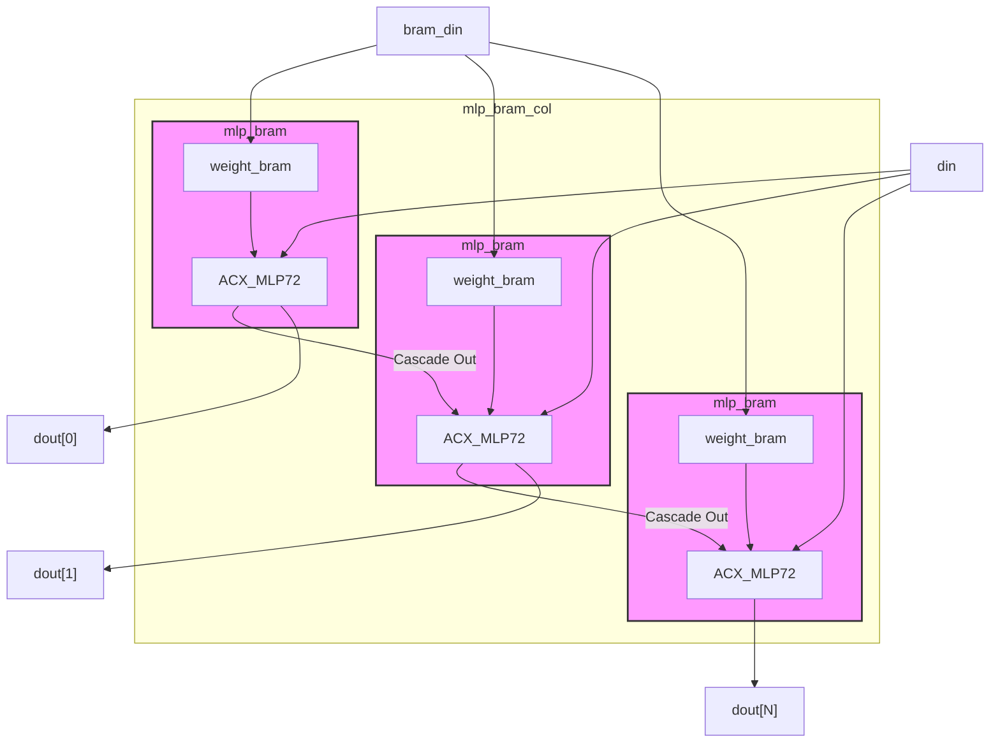
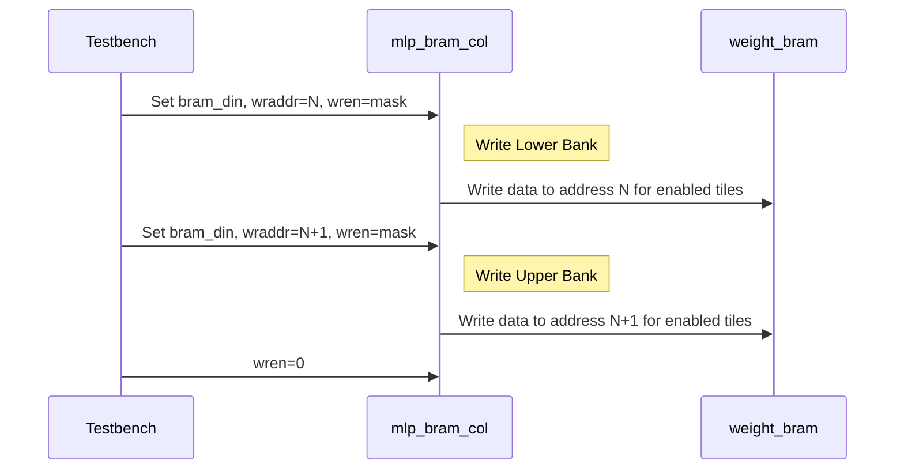
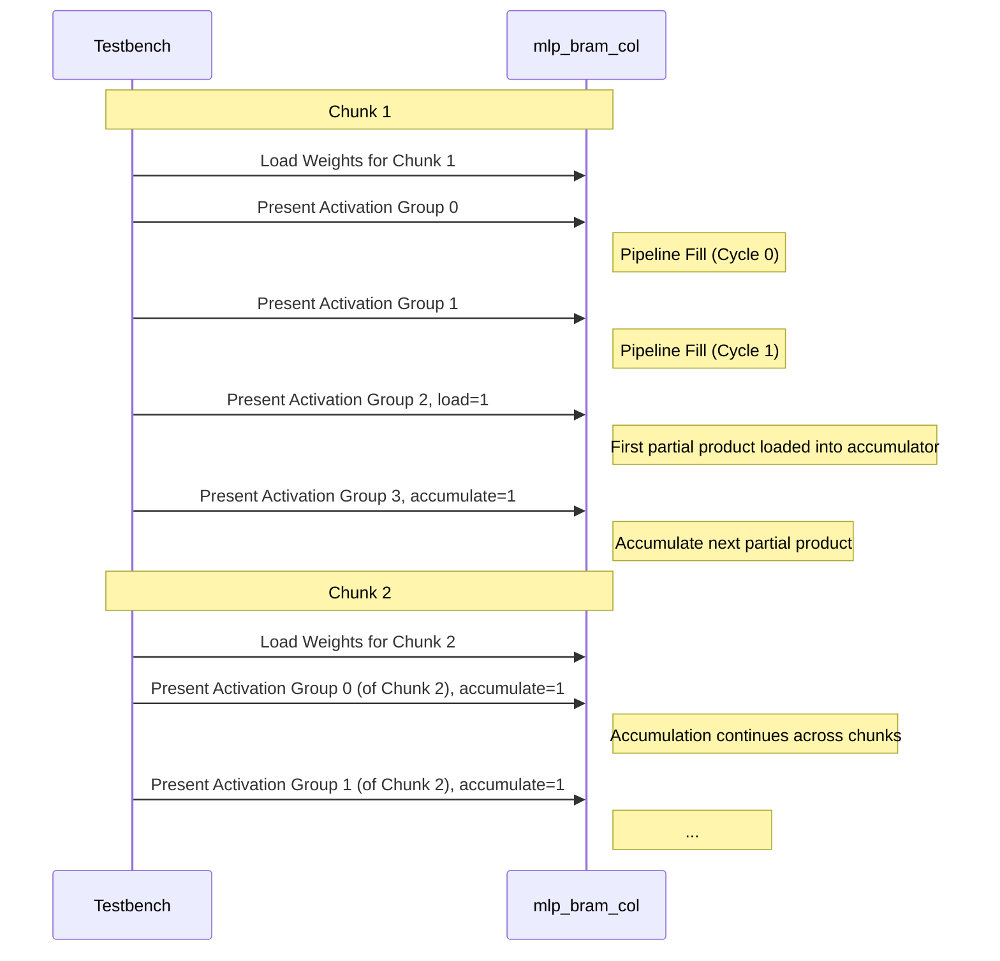

# Achronix MLP Column Architecture Manual

## 1. Purpose & Scope
This document provides a deep technical description of the RTL in `src/acx_mlp/rtl/`:

Modules covered:
- `mlp_bram_col.sv`: Column wrapper stacking multiple MLP + BRAM pairs.
- `mlp_bram.sv`: Wrapper integrating one MLP primitive (`ACX_MLP72`) with a local weight BRAM (`weight_bram`).
- `mlp_dot16_bfp8.sv`: Parameter-rich instantiation of `ACX_MLP72` configured for dual 8×8 Block-FP8 (BFP8) dot products.
- `mlp_dot16_int8.sv`: Configuration for dual 8×8 INT8 dot products.
- `weight_bram.sv`: BRAM primitive wrapper providing 144‑bit wide read path (two 72‑bit banks) for MLP parameters.

Focus areas:
1. Structural hierarchy & data path flow
2. Control scheme (external vs internal mapping)
3. Memory addressing & weight packing
4. Cascade interface usage and vertical scaling
5. Timing & pipeline stage orchestration
6. Multi-cycle accumulation protocol
7. INT8 vs BFP8 configuration differences
8. Extensibility, verification, and performance considerations

---
## 2. High-Level Overview
The design implements a vertical “column” of multiply–accumulate compute tiles specialized for performing two simultaneous 8×8 dot products per tile (lower and upper banks). Each tile contains:
1. A weight storage BRAM (72-bit ports aggregated internally as 144 bits for two banks).
2. An `ACX_MLP72` primitive configured to consume activations (`din`) and weights.
3. Optional cascade forwarding of multiplier A/B input busses to higher tiles.

The column top-level (`mlp_bram_col`) replicates `mlp_bram` instances `NUM_MLPS` times, wiring A/B cascade chains upward. Input activations are broadcast; BRAM writes are selectively gated per tile by `wren[N]` bits.



---
## 3. Module Hierarchy
```
mlp_bram_col
  ├─ mlp_bram (index 0, base)  --> mlp_dot16_bfp8 or mlp_dot16_int8 (inside via ACX_MLP72)
  ├─ mlp_bram (index 1)        --> mlp_dot16_* (cascade inputs from previous)
  ├─ ... (up to NUM_MLPS-1)
  └─ weight_bram (inside each mlp_bram)
```

`mlp_bram_col` chooses cascade mux selections for the base (A ports sourced from external `din`) and stacked instances (A ports sourced from prior instance cascade outputs). B ports in this configuration are always driven by local BRAM contents (no vertical cascade for B).

---
## 4. Data Path Breakdown

### 4.1 Inputs
- `din[71:0]`: Encodes either INT8 values or a Block-FP8 group (exponent + 8 mantissas) depending on configuration.
- `bram_din[71:0]`: Weight write data (one 72-bit bank per BRAM address). Two sequential addresses form a 144-bit parameter word (upper + lower bank).

### 4.2 Internal Expansion
Inside `mlp_bram`, BRAM read produces `bram_dout[143:0]` which splits into:
- Lower bank parameters: `bram_dout[71:0]`
- Upper bank parameters: `bram_dout[143:72]`

### 4.3 Multiplier Selection Multiplexers
Parameters like `mux_sel_multa_l`, `mux_sel_multb_l`, etc., select the bus feeding the 16 internal multipliers (two groups of eight). For the base tile:
- A ports use external `din` (broadcasted activations)
- B ports use BRAM outputs
Stacked tiles instead select cascade A buses (`fwdi_multa_*`) passed upward.

### 4.4 Adder Trees & Accumulators
Each group of eight multipliers feeds an adder reduction tree producing partial sums (`ADD07`, `ADD815`). Control options (`add_00_07_bypass`, `add_08_15_sub`, etc.) enable bypass/subtract or intermediate taps, though current configuration uses straightforward summation.

### 4.5 Floating vs Integer Paths
In BFP8 mode (`mlp_dot16_bfp8`):
- Mantissas are treated as integer operands combined with a shared exponent per group (block FP). Exponent manipulation and potential FP formatting occur later in the pipeline.
In INT8 mode (`mlp_dot16_int8`):
- Pure integer multiply–accumulate; floating-point pipeline stages (exponent delay, FP adders) are largely bypassed.

### 4.6 Output Formatting
The `outmode_sel` and `dout_mlp_sel` parameters select which internal register chain drives `dout[71:0]` (concatenation of bank outputs, accumulator slices, or status formatting). In dot-product usage, the lower 48 bits often carry combined accumulation results (truncated to FP24 / FP16 depending on configuration).

---
## 5. Control Scheme

### 5.1 External Signals (Column Level)
- `clk`: Shared synchronous clock.
- `rstn`: Active-high (in code: logic high means not in reset). Mapped internally to multiple reset domains.
- `ce`: Global enable gating progression of pipeline stages (along with finer-grained per-stage enables inside the primitive).
- `load`: On a valid cycle, loads the first computed dot-product into the accumulator pipeline registers (starting a new reduction sequence).
- `accumulate`: Enables accumulation of subsequent partial products into existing accumulator state.

### 5.2 Internal CE Mapping (`mlp_bram.sv`)
`mlp_ce` vector composition:
```
mlp_ce[11:0] = { lram_rdaddr[3:0], lram_wren, lram_rden, 3'b000, ce, ce, accumulate_ce }
               |<--addr bits-->|  |w|   |r|   |pad|  |timing enable|accumulate
```
Meaning:
- High bits: Provide micro-coded address related strobes for internal LRAM mode (currently unused for external functionality—LRAM is dormant).
- Two repeated `ce` entries drive core multiplier/adder progression.
- `accumulate_ce` occupies least significant position to selectively enable accumulation stage.

### 5.3 Internal Reset Mapping
`mlp_rstn = { 2'b00, rstn, lram_rstregn }`
- `rstn[1]` inside primitive used for principal pipeline registers.
- `lram_rstregn` reserved for local RAM output register (unused while LRAM disabled).

### 5.4 Load vs Accumulate Protocol
The software testbench asserts `load` one or more cycles after initiating dot-product computation to align with pipeline latency (e.g., after 2 cycles for first valid output). Subsequent segments assert `accumulate` while feeding new activation groups. This pattern supports large dot products by chunking weight BRAM loads and streaming activation vectors sequentially.

Sequence Example (multi-cycle dot):
```
Cycle 0: ce=1, load=0, accumulate=0 (pipeline fill)
Cycle 1: ce=1, load=0, accumulate=0 (pipeline fill)
Cycle 2: ce=1, load=1, accumulate=0 (first valid partial loaded)
Cycle 3+: ce=1, load=0, accumulate=1 (subsequent partials summed)
Final:  ce=0, accumulate=0 (freeze result)
```

---
## 6. Memory Architecture & Weight Handling

### 6.1 BRAM Layout
Each logical “parameter group” of 16 weights (8 lower bank, 8 upper bank) is stored across two consecutive BRAM write addresses:
```
Address N: Lower bank (8 bytes + optional exponent for BFP8)
Address N+1: Upper bank (8 bytes + optional exponent)
```
During simulation writes, `wren[NUM_MLPS-1:0]` acts as a per-tile mask, enabling selective parameter updates for any subset of column tiles in the same cycle.



### 6.2 Addressing
- Write address: `wraddr[9:0]` indexes 72-bit words. Two writes needed per full 144-bit weight set.
- Read address: `rdaddr[8:0]` selects which word(s) feed dot-product operations. The module consumes both banks in parallel each cycle (assuming proper latency alignment inside primitive).

### 6.3 BFP8 Packing
For BFP8 groups (group size 8):
```
Byte[0]   : Shared exponent (biased)
Byte[1:8] : 8 mantissas (signed / scale domain per quantization flow)
Total     : 9 bytes (72-bit word consumes 9*8 = 72 bits)
```
Two banks provide independent exponent + mantissa groups allowing dual dot products per tile.

### 6.4 INT8 Packing
INT8 mode typically omits an explicit exponent; the design either expects 8 raw bytes (and inserts a synthetic exponent on the activation side if needed) or treats exponent byte as neutral. In testbench, when only 8 activation bytes provided, a bias exponent is auto-inserted.

---
## 7. Cascade Chain & Vertical Scaling

### 7.1 Purpose
The cascade chain forwards multiplier input buses (A/B) upward to avoid re-driving identical activation data at higher tiles, reducing routing pressure and enabling shaped systolic configurations.

### 7.2 Implementation in `mlp_bram_col`
- Base tile outputs `fwdo_multa_*`, `fwdo_multb_*` which feed next tile’s `fwdi_*` ports.
- For stacked tiles, `mux_sel_multa_l=2'b11` & `mux_sel_multa_h=3'b111` select cascade feed rather than raw `din`.
- B ports continue to source local BRAM (no vertical cascading) to allow distinct weight sets per tile.

### 7.3 Extending `NUM_MLPS`
Increasing `NUM_MLPS` simply replicates generate block, wiring forward cascade outputs to next instance. Timing closure must consider added wirelength & cascade register bypass parameters (`del_multa_*`). For high Fmax, enabling delay registers at intermediate tiles may be necessary.

---
## 8. Timing & Pipeline Orchestration

### 8.1 Stage Summary
| Stage | Element                          | Controlled by | Latency (configurable) |
|-------|----------------------------------|---------------|-------------------------|
| 0     | Input mux & optional registers   | `del_multa_*`, `del_multb_*` | 0–1 cycles per path |
| 1     | Multiplier internal partial prods| Primitive internal | Fixed (hardware) |
| 2     | Adder tree reduction             | `del_add_*_reg` | 0–1 cycle |
| 3     | (Optional) FP exponent alignment | `del_expa/b/c/d_reg` | 0–3 cycles |
| 4     | FP mult pipe / bypass            | `del_fpmult_*_pipe_reg` | 0–1 cycle |
| 5     | Accumulator load / add           | `load`, `accumulate_ce` | Multi-cycle sequence |
| 6     | Output formatting & final regs   | `del_out_reg_*` | 0–1 cycle each slice |

### 8.2 Practical Latency Observations
Testbench asserts `load` on cycle ≈2 after asserting `ce`, indicating aggregate latency from initial activation/weight presentation to first valid dot result ~2 cycles (with current delay parameters: multipliers and adder tree registered, minimal FP pipeline).

### 8.3 Throughput
Once pipeline is primed, a new activation group can be accepted each cycle (assuming BRAM read latency overlapped and `ce=1`). Accumulator gating ensures either starting a new dot (`load=1, accumulate=0`) or extending the current dot (`load=0, accumulate=1`).

### 8.4 Clock Enables vs Power Optimization
Current configuration sets many `cesel_*` values to always-on (`4'hD` or `4'h2`). For energy-sensitive deployments, these could be remapped to selective clock-enable bits derived from micro-coded state (e.g., disabling FP path in pure INT8 mode).

---
## 9. Multi-Cycle Accumulation Protocol

Large dot products (e.g., >4096 parameters) are chunked:
1. Load a weight chunk into BRAM.
2. Stream corresponding activation groups, using `load` on the first valid partial and `accumulate` thereafter.
3. Repeat for subsequent chunks (`accumulate` continues, `load` suppressed) until all parameters processed.
4. Final result latched when `ce` deasserted.

Pseudo-flow:
```
for each chunk:
  write_chunk_weights()
  for each activation_group:
    present din
    if first_group_of_chunk and first_chunk: load=1 else load=0
    accumulate = (group_index > 0) or (not first_chunk)
```


---
## 10. INT8 vs BFP8 Configuration Differences

| Aspect                  | INT8 (`mlp_dot16_int8`)            | BFP8 (`mlp_dot16_bfp8`)                    |
|-------------------------|------------------------------------|--------------------------------------------|
| Exponent handling       | Usually bypassed / synthetic       | Real shared exponent per 8 mantissas       |
| `bytesel_*` parameters  | Select raw split / ×2 / ×4 modes   | Select block-FP grouping interpretation    |
| FP multiplier usage     | Bypassed (`fpmult_*_bypass=1`)     | Enabled for block FP scaling               |
| Output format options   | Integer accumulation / truncation  | FP24 / FP16 selectable via format params   |
| Accum precision         | Integer adder tree width           | Mantissa + exponent normalization impacts  |

Latency impact: BFP8 adds exponent alignment + optional format conversion stages; INT8 path faster, fewer registers enabled.

---
## 11. Verification Strategy Notes

### 11.1 Current Tests
- Random INT8 multi-cycle accumulation (`random_int_weights`).
- Block FP8 quantization tests (`random_gfp_weights`, scale sweeps, extreme magnitude tests).
- Large vector test (`big_dot`) exercising chunking logic and accumulator depth behavior.

### 11.2 Suggested Additions
- Bit-accurate FP vs integer cross-check using software model of accumulation rounding.
- Directed corner cases: all zeros, max positive, mixed sign extremes.
- Cascade integrity test: verify upper tiles produce identical results when fed identical weights with cascade A path vs direct `din` (validation of mux selections).
- Timing integrity: assert no use-before-write hazards on BRAM reads (instrument ready/valid handshake if expanded).

### 11.3 Waveform & Debug
Set `dump_waves=1` in `mlp_bram_col` parameters to enable VCD dumping via `$dumpvars`. Protected Achronix primitives may limit internal signal visibility; recommended to supplement with manual `add wave` scripts when GUI is available.

---
## 12. Extensibility & Adaptation

### 12.1 Wider Dot Products
Increase group size by switching `bytesel_*` to alternate multiplier packing modes (e.g., BF16 / FP16). Requires adjusting testbench packing logic and expected result scaling.

### 12.2 Sparsity / Early Exit
Introduce mask bytes in activation vector; modify weight loading & multiplier selection to skip zero lanes (clock-gate ce bits for disabled multipliers).

### 12.3 Streaming BRAM Refill
Replace bulk load with ping-pong BRAM banks enabling overlap of computation and weight transfer (requires dual-port or DMA-driven external loader plus handshake extension: `weights_valid`, `weights_ready`).

### 12.4 LRAM Utilization
Enable internal LRAM accumulation storage (`lram_*` signals currently stubbed). Could allow snapshotting partial sums or implementing FIFO-style streaming of intermediate layer outputs.

### 12.5 Mixed Precision
Instantiate a mix of INT8 and BFP8 configured tiles within one column (parameterize module type per index) for heterogeneous layer processing.

---
## 13. Performance Considerations
- Pipeline register enables (`del_*`) should be tuned post-synthesis for target Fmax (e.g., enabling input and adder stage registers for >500 MHz operation as noted in comments).
- Cascading many tiles increases path length for A buses; enabling `del_multa_*` only on some tiers can balance latency vs resource usage.
- Integer mode can disable FP-specific logic to reduce dynamic power (map `cesel_*` away from always-on).

---
## 14. Known Limitations / Open Questions
- Internal LRAM currently unused; address mapping in comments implies repurposing `ce` bits—documented but not functionally integrated.
- Protected primitive signal visibility limits deep waveform debug without vendor tooling.
- Testbench uses heuristic (assert `load` at i==2) for first-valid timing; a formal ready/valid interface would improve robustness if latency changes.

---
## 15. Quick Reference Signal Table (Column Level)
| Signal        | Direction | Width              | Description |
|---------------|-----------|--------------------|-------------|
| `din`         | In        | 72                 | Activation group (INT8 or BFP8 packed). |
| `bram_din`    | In        | 72                 | Weight write data (one bank). |
| `wraddr`      | In        | 10                 | BRAM write address (two consecutive writes per 16 weights). |
| `wren`        | In        | NUM_MLPS           | Per-tile write enable bitmask. |
| `rdaddr`      | In        | 9                  | BRAM read address (bank pair). |
| `load`        | In        | 1                  | Load accumulator with first valid partial. |
| `accumulate`  | In        | 1                  | Enable addition of subsequent partials. |
| `dout[i]`     | Out       | 72 per tile        | Packed results (format depends on configuration). |

---
## 16. Validation Checklist
Before integrating into a larger system:
1. Confirm BRAM initialization sequence matches endianness expected by software packer.
2. Re-run latency characterization after changing any `del_*` parameters.
3. Sweep activation & weight scaling factors to ensure no overflow in accumulator truncation path.
4. Evaluate synthesis reports for cascade path critical routing; consider register insertion if needed.
5. Add assertions around `load` sequencing (e.g., forbid simultaneous `load & accumulate` on first valid cycle unless protocol specifically supports it).

---
## 17. Future Work Opportunities
- Add AXI-lite CSR block to control `NUM_MLPS`, enable selective power-down, query status.
- Integrate formal (Yosys-SMTBMC) harness for multiplier tree invariants (sum correctness for small vectors).
- Implement streaming output to external fabric (add `dout_valid`, `dout_ready`).
- Provide golden software model in repository (`python` reference implementing identical BFP rounding semantics).

---
## 18. Concrete Example: 8 MLPs Configuration

This section provides a concrete example of the `mlp_bram_col` configured with `NUM_MLPS=8`.

### 18.1 Output Count

```
8 MLPs × 2 banks/MLP = 16 parallel dot products per cycle
```

Each MLP produces two independent 8-element dot product results (bank0 and bank1).

### 18.2 Data Flow (Broadcast Architecture)

```
                    din (72-bit)
                         │
           ┌─────────────┼─────────────┐
           │             │             │
           ▼             ▼             ▼
        ┌─────┐       ┌─────┐       ┌─────┐
        │MLP 0│  ...  │MLP 3│  ...  │MLP 7│
        ├─────┤       ├─────┤       ├─────┤
        │bank0│       │bank0│       │bank0│  ← weights from BRAM (different per MLP)
        │bank1│       │bank1│       │bank1│
        └──┬──┘       └──┬──┘       └──┬──┘
           │             │             │
           ▼             ▼             ▼
        dout[0]       dout[3]       dout[7]
        (2×FP24)     (2×FP24)      (2×FP24)
```

**Key Point**: ALL MLPs receive the SAME `din` (activations are broadcast). Each MLP has DIFFERENT weights in its BRAM. Both banks within an MLP compute the same activations × different weights.

### 18.3 Pipeline Timing

```
Cycle 0: din[0] applied, rdaddr=0, ce=1, load=0, accumulate=0
         → Pipeline stage 0 (input registers)

Cycle 1: din[1] applied, rdaddr=1, ce=1, load=0, accumulate=1
         → Pipeline stage 1 (multiply)

Cycle 2: din[2] applied, rdaddr=2, ce=1, load=1, accumulate=1
         → First valid result appears, loaded into accumulator

Cycle 3+: din[n] applied, rdaddr=n, ce=1, load=0, accumulate=1
         → Subsequent results accumulated
```

**Pipeline Latency: 2 cycles** from first valid activation input to first valid output.

### 18.4 Single-Cycle vs Multi-Cycle Dot Products

| Mode | Activations | Weights per MLP | Results |
|------|-------------|-----------------|---------|
| Single-cycle (8 elements) | 8 elements × 1 cycle | 8 per bank × 2 banks = 16 | 16 dot products |
| Multi-cycle (32 elements) | 8 elements × 4 cycles | 32 per bank × 2 banks = 64 | 16 dot products (accumulated) |
| Multi-cycle (N×8 elements) | 8 elements × N cycles | N×8 per bank × 2 banks | 16 dot products (accumulated) |

### 18.5 Result Format

Each `dout[i]` (72-bit) contains (per `outmode_sel=2'b11` in `mlp_dot16_bfp8.sv`):
- `dout[i][47:24]`: Bank 0 result (AB/Lower, FP24)
- `dout[i][23:0]`: Bank 1 result (CD/Upper, FP24)
- `dout[i][71:48]`: Status (fp_ab_status[3:0], fp_cd_status[3:0], zeros)

### 18.6 Use Case Mapping

This architecture is designed for **neural network inference**:
- One input activation vector broadcasts to all MLPs
- Each MLP holds a different weight column (output neuron)
- Result: One forward pass computes multiple output neurons in parallel

**NOT designed for**: Single large dot product (e.g., 128 elements → 1 scalar). That would require splitting activations across MLPs with different din per MLP, which `mlp_bram_col` does not support (din is broadcast).

### 18.7 Vector-Matrix Multiplication Interpretation

The `mlp_bram_col` architecture naturally implements **vector-matrix multiplication** (batch=1):

```
y = x · W

Where:
  x: (1 × N) activation row vector
  W: (N × 16) weight matrix (16 columns stored in 8 MLPs × 2 banks)
  y: (1 × 16) output row vector
```

**Computation:**
```
y[0]  = Σ x[i] × W[i, 0]    (MLP0, result at dout[0][23:0])
y[1]  = Σ x[i] × W[i, 1]    (MLP0, result at dout[0][47:24])
y[2]  = Σ x[i] × W[i, 2]    (MLP1, result at dout[1][23:0])
y[3]  = Σ x[i] × W[i, 3]    (MLP1, result at dout[1][47:24])
...
y[14] = Σ x[i] × W[i, 14]   (MLP7, result at dout[7][23:0])
y[15] = Σ x[i] × W[i, 15]   (MLP7, result at dout[7][47:24])
```

**Data Layout (verified against `acx_mlp_tests.py`):**
- Activation `x` streams via `din` (8 elements per cycle, N/8 cycles total)
- Weight column `W[:, j]` loaded via `write_bram_params()`:
  - Even columns (j=0,2,4...) → `bank0_params` → odd wraddr → physical Bank 1 (CD)
  - Odd columns (j=1,3,5...) → `bank1_params` → even wraddr → physical Bank 0 (AB)
- Output `y[j]` read from `dout[j//2]`:
  - Even columns (j%2==0) → `dout[j//2][23:0]`
  - Odd columns (j%2==1) → `dout[j//2][47:24]`

**Note:** The logical column index (0,1) maps inversely to physical bank (1,0) due to the BRAM write interleaving in `write_bram_params()`.

This is the standard **linear layer** / **fully-connected layer** computation in neural networks.

---
## 19. Parallelism and Throughput

For detailed throughput analysis including:
- Peak parallelism (128 MACs/cycle)
- Efficiency formulas: `V / (V + 3)`
- Measured vs theoretical efficiency tables
- Weight loading amortization

See **[BCV Computation Guide Section 7](BCV_COMPUTATION_GUIDE.md#7-parallelism-and-throughput)**.

---
## 20. Summary

The RTL forms a modular, extensible vertical compute column optimized for dual 8×8 dot products per tile with support for both INT8 and Block-FP8 representations. Key features:

- **Control signals**: `load`, `accumulate`, internal `ce` bits enable scalable accumulation
- **Timing flexibility**: Optional pipeline registers for Fmax tuning
- **Cascade chaining**: Reduces redundant data distribution for stacked MLPs
- **Peak throughput**: 128 MACs/cycle (see [BCV Guide](BCV_COMPUTATION_GUIDE.md#7-parallelism-and-throughput))

The design can evolve toward higher precision, streaming capability, and energy efficiency with modest structural changes.
